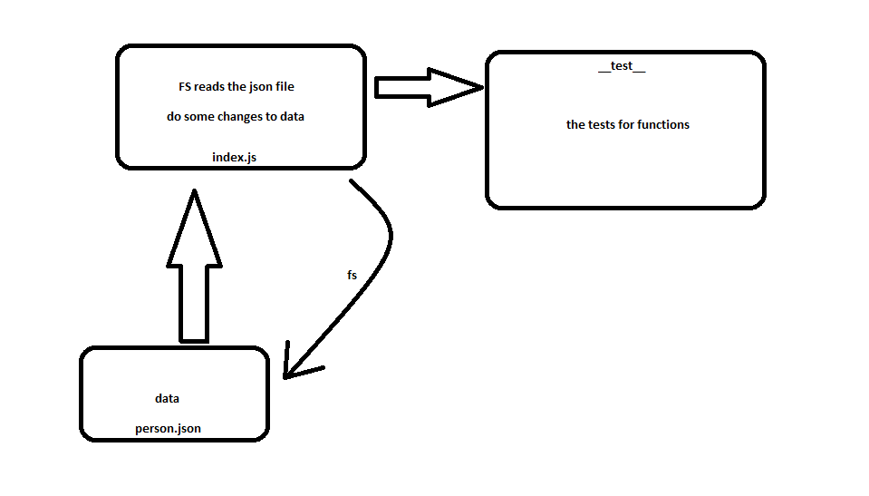

# LAB - Class 03

## Async

### Author: obada al-quran

### Links and Resources

- [submission PR](http://xyz.com)
- [ci/cd](http://xyz.com) (GitHub Actions)

### Setup

#### How to initialize/run your application (where applicable)

- e.g. `npm start`

#### Tests

- How do you run tests? `npm test`
- Any tests of note? `no`
- Describe any tests that you did not complete, skipped, etc

#### UML

